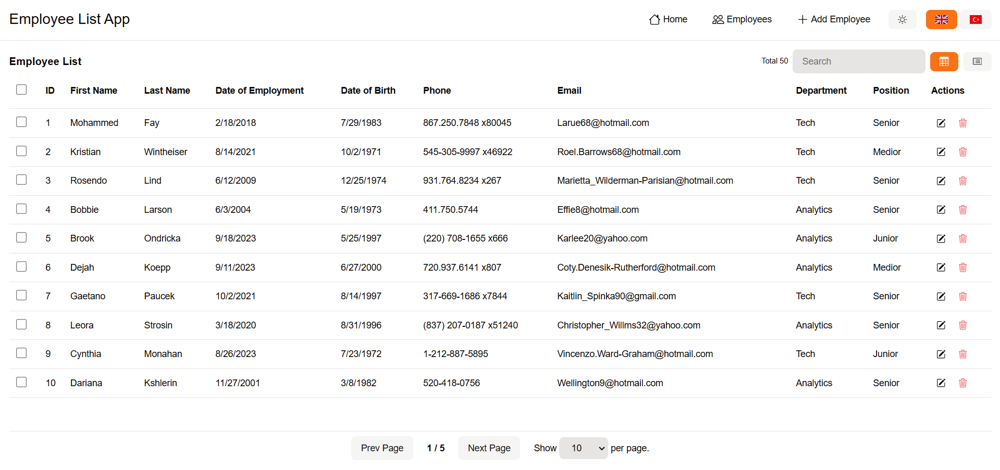

# Employee List with LitElement

Demo
[https://yyasinaslan.github.io/employee-list/](https://yyasinaslan.github.io/employee-list/)

# Install

```shell
npm install
```

# Start Dev Server

```shell
npm run dev
```

# Running Tests and linting

```shell
npm run lint

npm run test
```

# Translation

```shell
# First extract translated strings with
npm run extract-i18n

# After translating .xlf files run comand below 
# to generate runtime templates 
npm run build-i18n

```

# Preview

